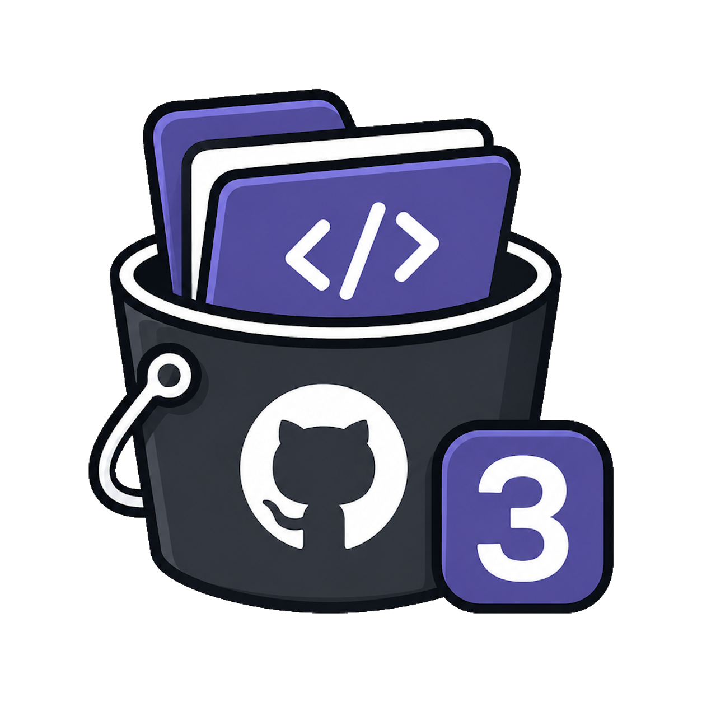

<div align="center">
  
  <h1>Repo3</h1>

  <p>
    <a href="https://github.com/OMouta/repo3/actions/workflows/ci.yml"></a>
    <a href="https://github.com/OMouta/repo3/actions/workflows/docker.yml"></a>
    <a href="https://github.com/OMouta/repo3/pkgs/container/repo3"></a>
    <a href="https://github.com/OMouta/repo3/releases"></a>
    <a href="https://github.com/OMouta/repo3/blob/main/LICENSE"></a>
    
    
    
    
    
  </p>
</div>

Highly reliable S3-compatible object storage powered entirely by GitHub repositories. 100% uptime, 0% chance of rollback incidents.

> “Finally, object storage with commit history.”

---

## Why?

Modern object storage solutions are complex, battle-tested distributed systems designed by teams of world-class infrastructure engineers.

Repo3 ignores all of that and stores your objects directly inside GitHub repositories instead.

This gives you access to:

* Enterprise-grade distributed commit persistence
* Globally replicated infrastructure
* Built-in object versioning through Git history
* Rollback-resistant architecture
* Professionally managed uptime
* The emotional comfort of seeing your JPEGs inside a repo tree

---

## Architecture

```txt
S3 Bucket     → GitHub Repository
Object Key    → File Path
PUT Object    → Commit File
DELETE Object → Commit Deletion
Versioning    → Git History
```

Example:

```txt
s3://memes/images/cat.png
↓
github.com/your-org/memes/blob/main/images/cat.png
```

---

## Features

* S3-compatible API
* GitHub-backed storage
* Object versioning via commits
* Works with AWS SDKs
* Works with MinIO clients
* Zero custom storage engine
* 100% transparent storage backend
* Enterprise-grade rollback opportunities

---

## Example

Create a bucket:

```bash
aws --endpoint-url http://localhost:9000 s3 mb s3://memes
```

Upload an object:

```bash
aws --endpoint-url http://localhost:9000 s3 cp cat.png s3://memes/images/cat.png
```

List objects:

```bash
aws --endpoint-url http://localhost:9000 s3 ls s3://memes/images/
```

Internally this becomes:

```txt
github.com/your-org/memes/blob/main/images/cat.png
```

---

## Reliability

Repo3 is built on top of GitHub, one of the most trusted platforms in software engineering.

This means your objects benefit from:

* Distributed infrastructure
* Redundant storage
* Commit history
* Enterprise operations
* Absolutely no concerning rollback incidents whatsoever

Your data is safe.*

* Safe is defined emotionally, not legally.

---

## Performance

Repo3 delivers acceptable performance for workloads including:

* Memes
* Side projects
* JPEG archival
* Chaos engineering
* Extremely questionable architecture experiments
* “It would be funny if this actually worked”

Not recommended for:

* Production databases
* Large media workloads
* Compliance-sensitive environments
* Any system described as “mission critical”
* Human civilization infrastructure

---

## Running

Create a local `.env` file:

```env
GITHUB_TOKEN=github_pat_your_token
REPO3_OWNER=your-org
REPO3_PORT=9000
```

Then start the server:

```bash
repo3 serve
```

You can still override values with flags:

```bash
repo3 serve \
  --github-token $GITHUB_TOKEN \
  --owner your-org \
  --addr :9000
```

Supported server environment keys:

```env
GITHUB_TOKEN=github_pat_your_token
REPO3_OWNER=your-org
REPO3_ADDR=:9000
REPO3_PORT=9000
REPO3_DEFAULT_BRANCH=main
REPO3_ACCESS_KEY=repo3
REPO3_SECRET_KEY=devsecret
```

---

## Docker

Repo3 is fully containerized for modern cloud-native deployment workflows because every enterprise storage platform needs a Docker image.

Pull the official image from GitHub Container Registry:

```bash
docker pull ghcr.io/omouta/repo3:latest
```

Run your globally distributed object storage platform:

```bash
docker run --rm \
  --env-file .env \
  -p 9000:9000 \
  ghcr.io/omouta/repo3:latest
```

Your production-ready object storage cluster is now operational.

### Compose

For highly available enterprise deployments:

```bash
docker compose up --build
```

### Container features

* OCI-compliant
* Cloud-native
* GitOps-compatible
* Horizontally questionable
* Enterprise-adjacent
* Commit-backed persistence
* Kubernetes-ready for absolutely no reason

---

## Compatibility

Repo3 aims to support:

* AWS SDKs
* AWS CLI
* MinIO client
* Basic S3 tooling
* Theoretical enterprise adoption

---

## Roadmap

* Multipart uploads
* Presigned URLs
* GitLab backend
* Gitea backend
* Local git backend
* Object lifecycle policies
* Glacier-equivalent cold storage (archived repositories)
* Multi-region replication (multiple GitHub organizations)
* SOC2-looking diagrams

---

## FAQ

### Is this production ready?

No.

### Should I store critical infrastructure assets in this?

Also no.

### Is it technically hilarious?

Yes.

### Could this accidentally become useful?

Unfortunately, yes.

---

## License

MIT

Use responsibly, irresponsibly, or academically.
